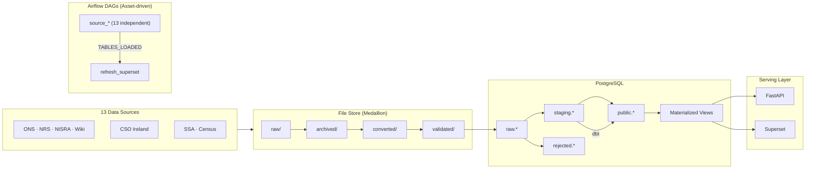

# Population Names Pipeline

A full-stack data engineering portfolio demo that ingests forename and surname
data from UK, Irish, and US government sources, transforms it through a medallion
architecture data lake, and serves it via a REST API and dashboards.

The entire project runs locally with Docker Compose (`just setup`). An optional
AWS deployment using Terraform is included but not required.

## Contents

- [Local development](#local-development)
- [Tech stack](#tech-stack)
- [Data pipeline](#data-pipeline)
- [Data sources](#data-sources)
- [Data quality notes](#data-quality-notes)
- [API](#api)
- [AWS deployment](#aws-deployment-optional)
- [Productionalization](#productionalization)

## Local development

### Prerequisites

- [Docker](https://docs.docker.com/get-docker/) and Docker Compose
- [just](https://github.com/casey/just) command runner
- [uv](https://github.com/astral-sh/uv) Python package manager

### Quick start

```bash
just setup
```

This downloads source data, starts all services, runs migrations, seeds Superset
dashboards, and triggers the full pipeline. Once complete:

- API docs: http://localhost:8000/docs
- Airflow UI: http://localhost:8080 (admin / password from `AIRFLOW_ADMIN_PASSWORD` in `.env`)
- Superset: http://localhost:8088 (admin / password from `SUPERSET_ADMIN_PASSWORD` in `.env`)

### Commands

| Command | Description |
|---------|-------------|
| `just up` | Start all Docker services |
| `just down` | Stop all services |
| `just setup` | Full setup: download data, start, migrate, seed, run pipeline |
| `just pipeline` | Run pipeline via Airflow |
| `just store-status` | Show file store tier status |
| `just store-retrieve` | Copy raw files to archived tier |
| `just store-promote` | Promote archived -> converted -> validated |
| `just dbt-run` | Run dbt models |
| `just dbt-test` | Run dbt tests |
| `just dbt-docs` | Generate and serve dbt documentation |
| `just test` | Run API tests |
| `just lint` | Lint with ruff |
| `just format` | Format with ruff |
| `just logs` | Tail Docker Compose logs |
| `just clean` | Stop services and remove volumes |

### Authentication

The API is protected by an API key generated during setup. Find your key in `.env`:

```bash
grep API_KEY .env
```

Pass it via the `X-API-Key` header:

```bash
curl -H "X-API-Key: <your-key>" http://localhost:8000/api/v1/forenames
```

Or use the **Authorize** button in the Swagger UI at `/docs` to set it for all requests.

## Tech stack

| Layer | Technology |
|-------|------------|
| API | Python 3.12, FastAPI, SQLAlchemy (async), Pydantic |
| Database | PostgreSQL (raw, staging, public schemas + materialized views) |
| Transforms | dbt (staging views, rejected-row tracking, data tests) |
| Orchestration | Airflow 3 (Task SDK, asset-driven DAGs) |
| Dashboards | Apache Superset |
| Infrastructure | Docker Compose (local), Terraform + ECS Fargate (AWS) |
| Tooling | uv (packages), just (task runner), Alembic (migrations), ruff (lint) |

### Architecture



### Project structure

```
population-names/
  src/
    api/            FastAPI application and routers
    db/             SQLAlchemy models and session config
    schemas/        Pydantic request/response schemas
  pipeline/
    sources.yml     Source manifest (URLs, formats, column maps, quality thresholds)
    store.py        File store lifecycle management (retrieve, convert, validate)
    manifest.py     Manifest loader
    transforms/     Per-source transforms (gb_england_wales, ie, gb_scotland, etc.)
  scripts/
    download_sources.py  Download raw data from GitHub release asset
    store_cli.py         CLI for file store operations
    ingest.py            Load validated CSVs into PostgreSQL (change detection, rollback)
    quality_check.py     Post-dbt quality gate (done/rejected file routing)
    scrapers/            Wikipedia/Wiktionary scrapers (NI surnames, Wales surnames)
    refresh_views.sql    Drop and recreate materialized views (runs after dbt)
  dbt_project/
    models/staging/           Staging views (clean, validate, filter)
    models/staging/rejected/  Rejected-row views (rows dropped by staging, with reasons)
    models/public/            Public views (joined to dimensions, year-filtered)
    tests/                    Custom data tests (empty tables, counts, year ranges)
  alembic/            Database migrations (schemas, raw tables, dimension seed data)
  airflow/dags/     Airflow DAG definitions
  superset/         Superset queries, dataset configs, and dashboard seeding
  data/             File store tiers (raw/ through done/rejected/), downloaded at setup
  tests/            API, pipeline, and scraper tests
  terraform/        AWS infrastructure (ECS Fargate, RDS, ALB, S3)
```

## Data pipeline

The pipeline follows a medallion architecture with dynamic file discovery,
schema migration handling, and data quality gating.

### File lifecycle

```
data/raw/              Downloaded at setup time from GitHub release
  -- retrieve -->  data/archived/{source}/    Glob-matched copies (bronze)
  -- convert  -->  data/converted/{source}/   Normalized CSVs (silver)
  -- validate -->  data/validated/{source}/   Schema-checked, ready to load (gold)
  -- ingest   -->  PostgreSQL raw.* tables    COPY into raw schema
  -- dbt      -->  staging.* -> public.*      Transform, validate, serve
                   rejected.*                 Rows dropped by staging (with reasons)
  -- quality  -->  data/done/{source}/        Files that passed quality gate
                   data/rejected/{source}/    Files that failed quality gate
```

### What runs where

| Step | Code | What it does |
|------|------|--------------|
| **Retrieve** | `pipeline/store.py` `retrieve()` | Globs `store.file_pattern` (from `pipeline/sources.yml`) against `data/raw/`, copies matches to `data/archived/{source}/`. Scrapers run instead for wiki-sourced data. |
| **Convert** | `pipeline/store.py` `promote_to_converted()` | Runs per-source transforms (`pipeline/transforms/*.py`) that handle format differences: ZIP extraction, XLSX sheet selection, PxStat CSV parsing, schema migration between file versions. Generic fallback handles simple CSV/XLSX/ZIP. |
| **Validate** | `pipeline/store.py` `promote_to_validated()` | Checks archived files against `quality.expected_columns` (rejects wrong schemas to `data/rejected/`). Promotes converted files to validated tier. |
| **Ingest** | `scripts/ingest.py` | `COPY`s validated CSVs into `raw.*` tables via psycopg2. Change-detection skips unchanged files. All raw columns are TEXT. Rolls back and fails if 0 rows are ingested from non-empty file lists. |
| **dbt staging** | `dbt_project/models/staging/stg_*.sql` | Views that clean raw data: `initcap(trim(...))` names, validate name characters (`^[[:alpha:]' -]+$` -- accepts accented/Unicode letters), check sex codes (`M`/`F`), cast types. Bad rows are filtered out here. |
| **Rejected rows** | `dbt_project/models/staging/rejected/rej_*.sql` | One view per source capturing rows dropped by staging, with a `rejection_reason` column (e.g. `name_null`, `name_invalid_chars`, `sex_invalid`). `rej_all` unions all 13 into a single view with common columns (`source_table`, `rejection_reason`, `raw_name`, `file_log_id`). |
| **Quality gate** | `scripts/quality_check.py` | Post-dbt: queries `rejected.rej_{source}` per file, compares rejection rate against `max_rejected_pct` threshold from `sources.yml`. Moves archived files to `data/done/` (passed) or `data/rejected/` (failed), updates `file_log.status`. Exit code signals Airflow: 0 = all passed, 2 = partial (skipped/yellow), 1 = all failed. |
| **dbt public** | `dbt_project/models/public/` | Joins staged data to dimension tables (countries, genders), applies `min_year` filter, materializes final tables. |
| **Refresh MVs** | `scripts/refresh_views.sql` | Drops and recreates materialized views (forenames, surnames, rankings). Runs after each source DAG because dbt's view swap drops dependent MVs via CASCADE. |

### Schema migration examples

- **ONS England/Wales XLSX**: `ons_forenames` uses Table_6/sheet `6` (all names, E&W combined); `wales_forenames` uses Table_3/sheet `3` (top 100, Wales only). 2021 files use numeric sheet names with extra note rows; 2022+ use `Table_N` names with clean headers. Transform tries both sheet name candidates.
- **Ireland CSO PxStat**: 5-column format (`Statistic Label, Year, {Name}, UNIT, VALUE`) with UTF-8 BOM. VALUE is occurrence count for forenames, rank for surnames. Empty VALUE = suppressed data.

### Orchestration

13 independent source DAGs plus downstream consumers, all event-driven via Assets:

```
source_* (13 DAGs, one per source):
  retrieve -> promote_converted -> promote_validated -> ingest
    -> dbt_run -> dbt_test -> quality_gate -> dbt_source_freshness -> refresh_views
                                                                         | TABLES_LOADED

refresh_superset:                              (triggered by TABLES_LOADED)
  warm chart caches
```

Each source pipeline runs the full dbt lifecycle plus a per-file quality gate:

| Task | What it does |
|------|--------------|
| `dbt_run` | Builds staging views + rejected-row views for the source (`stg_{source}+`, `rej_{source}`) |
| `dbt_test` | Runs staging model tests and source-level tests (raw `not_null` tests are `severity: warn` so bad files don't block the DAG) |
| `quality_gate` | Evaluates each file's rejection rate against threshold, routes to `done/` or `rejected/`. Partial pass shows as yellow (skipped) in the Airflow grid. |
| `dbt_source_freshness` | Checks `_loaded_at` against freshness SLAs (warn 24h, error 72h) |

`trigger_all_sources` fires all 13 source DAGs in parallel. Pass `{"force": true}`
in DAG conf to re-ingest unchanged files. Superset dashboards are seeded once
during setup (not via DAG).

## Data sources

| Source | Country | Type | Origin | License |
|--------|---------|------|--------|---------|
| ONS England & Wales Forenames | GB | Forename | ons.gov.uk | OGL v3.0 |
| England Surnames | GB | Surname | github.com/matt40k | OGL v3.0 |
| ONS Wales Forenames | GB | Forename | ons.gov.uk | OGL v3.0 |
| Wales Surnames | GB | Surname | wikipedia.org, wiktionary.org | CC BY-SA |
| NRS Scotland Forenames | GB | Forename | nrscotland.gov.uk | OGL v3.0 |
| NRS Scotland Surnames | GB | Surname | nrscotland.gov.uk | OGL v3.0 |
| NISRA Northern Ireland Forenames | GB | Forename | nisra.gov.uk | OGL v3.0 |
| NI Surnames | GB | Surname | wikipedia.org | CC BY-SA |
| CSO Ireland Forenames (Boys) | IE | Forename | cso.ie | CC BY 4.0 |
| CSO Ireland Forenames (Girls) | IE | Forename | cso.ie | CC BY 4.0 |
| CSO Ireland Surnames | IE | Surname | cso.ie | CC BY 4.0 |
| SSA US Forenames | US | Forename | ssa.gov | Public Domain |
| US Census Surnames | US | Surname | census.gov | Public Domain |

## Data quality notes

| Issue | Scope | Detail |
|-------|-------|--------|
| England & Wales forenames suppress rare names | `ons_forenames` | ONS redacts names with fewer than 3 occurrences for privacy. This affects the long tail but not diversity metrics meaningfully (~6,000-7,000 unique names per sex per year). |
| England surnames lack year range | `england_surnames` | Single snapshot from 2014, no time series. |
| England surnames have mixed casing | `england_surnames` | Source mixes ALL-CAPS (~214) and initcap (~776) names. dbt staging normalizes via `initcap()` and deduplicates with summed counts. |
| NI forenames have suppressed values | `nisra_forenames` | Counts below 3 are marked ".." and excluded during transform. |
| NI surnames are a proxy dataset | `ni_surnames` | No official NI surname dataset exists with a clear license. Source is Wikipedia's Irish-origin surname categories, which cover Ireland broadly, not NI specifically. Year is set to the current year at pipeline run time (no date in source data). |
| NI surnames have no count | `ni_surnames` | Source is a name list only (no frequency data). `count` is set to `1` as a presence marker. Not comparable to count-based sources. |
| Wales forenames are top-100 only | `wales_forenames` | ONS Table_3 provides only the top 100 names for Wales specifically. The full E&W dataset (Table_6) is used for `ons_forenames` but does not split by country. |
| No Wales-specific surname source | `wales_surnames` | No official Wales-only surname dataset exists. Source combines Welsh-origin surnames from Wikipedia (~80 names, no counts) with Wiktionary's top 250 England & Wales surnames (2002 data). Coverage is approximate and not directly comparable to official sources. |
| Wales surnames scraped from wikis | `wales_surnames` | Data comes from community-edited Wikipedia/Wiktionary pages, not a government statistical agency. Quality and completeness may vary. |
| US forenames pre-1975 excluded | `ssa_forenames` | SSA data goes back to 1880 but only 1975-2024 files are shipped. Pre-1975 rows would be filtered by `min_year` since no other country has data before 1975. |

## API

The FastAPI application serves name popularity data under the `/api/v1` prefix.
Interactive documentation is available at `/docs` (Swagger UI) and `/scalar`
(Scalar) when the API is running.

## AWS deployment (optional)

<details>
<summary>The <code>terraform/</code> directory contains a full AWS deployment using ECS Fargate, RDS, S3, and ALB. Click to expand.</summary>

### Prerequisites

- [Terraform](https://developer.hashicorp.com/terraform/install) >= 1.5
- [AWS CLI](https://aws.amazon.com/cli/) configured with credentials
- [Docker](https://docs.docker.com/get-docker/) (for building and pushing images)

### What gets created

| Resource | Details |
|----------|---------|
| VPC | 2 AZs, public + private subnets, NAT gateway |
| RDS | PostgreSQL 16.4 (db.t3.micro, Free Tier eligible), 3 databases on one instance |
| ECS Fargate | 4 services: API, Airflow webserver, Airflow scheduler, Superset |
| ALB | Port 80 (API), 8080 (Airflow), 8088 (Superset) |
| ECR | 2 repositories (api, airflow) |
| S3 | Data bucket (replaces local `data/` directory) |
| Secrets Manager | All credentials in a single JSON secret |
| CloudWatch | Log groups for each ECS service (7-day retention) |

### Pre-flight validation

Before deploying to AWS, validate locally to catch failures that would otherwise
cost money to debug:

```bash
# 1. Validate the Terraform config (no AWS credentials needed)
cd terraform && ./deploy.sh validate

# 2. Build the Docker images and test the ECS startup commands locally
cd .. && just test-images
```

`just test-images` builds the same Docker images that `deploy.sh` pushes to ECR,
verifies that all required files are baked in (DAGs, alembic, dbt project, etc.),
and runs the critical startup commands (Alembic migrations, Airflow db migrate)
against your local Docker Compose database. If both steps pass, the deploy should
work on the first attempt.

Things that can only be verified on AWS (networking, IAM, service discovery) are
determined by the Terraform config and generally don't require iteration -- if
`terraform plan` succeeds, they're almost certainly correct.

### Deploy

Fargate, NAT Gateway, and ALB have no free tier. Expect ~$0.17/hr while
resources are running. Plan to `destroy` immediately after verifying.

```bash
cd terraform

# Review what will be created (free)
./deploy.sh plan

# Apply infrastructure, build/push images, redeploy services
# (prompts for confirmation after showing the plan)
./deploy.sh

# Run post-deploy setup (migrations, dbt, DAG unpause, Superset seed, pipeline)
./post-deploy.sh

# IMPORTANT: tear down when done
./deploy.sh destroy
```

`deploy.sh` creates the infrastructure, builds Docker images, pushes them to ECR,
and forces an ECS service redeployment. `post-deploy.sh` then runs the same setup
steps that `just setup` handles locally:

| Step | `just setup` (local) | `post-deploy.sh` (AWS) |
|------|----------------------|------------------------|
| DB schema | `just migrate` (Alembic) | `./post-deploy.sh migrate` |
| dbt models | `docker compose run dbt` | `./post-deploy.sh dbt` |
| Materialized views | `psql < refresh_views.sql` | `./post-deploy.sh views` |
| Unpause DAGs | `airflow dags unpause ...` | `./post-deploy.sh unpause` |
| Seed Superset | `seed_superset.py` | `./post-deploy.sh seed` |
| Trigger pipeline | `airflow dags trigger ...` | `./post-deploy.sh trigger` |

Each step can be run individually or all at once (the default).

### Configuration

Copy the example tfvars to customize:

```bash
cp terraform.tfvars.example terraform.tfvars
```

Key variables:

| Variable | Default | Description |
|----------|---------|-------------|
| `aws_region` | us-west-2 | AWS region |
| `environment` | poc | Environment name (used in resource naming) |
| `db_instance_class` | db.t3.micro | RDS instance size |
| `api_cpu` / `api_memory` | 256 / 512 | API task sizing (CPU units / MiB) |
| `airflow_cpu` / `airflow_memory` | 512 / 1024 | Airflow task sizing |
| `superset_cpu` / `superset_memory` | 512 / 1024 | Superset task sizing |

### Tear down

```bash
cd terraform
./deploy.sh destroy
```

This destroys all AWS resources. RDS snapshots are skipped and S3 buckets are
force-deleted (POC settings).

</details>

## Productionalization

Everything runs from a single repo and a single `just setup` for easy evaluation of the portfolio project.
In a real environment, the main structural changes would be:

- **Repository separation.** Superset, Airflow DAGs, the dbt project, and the API would each live in their own repository with independent CI/CD and release cycles. Superset dashboards would be exported as JSON and version-controlled separately. The shared pipeline library (`pipeline/`) would be published as an internal Python package that each repo depends on.

- **Independent scaling and isolation.** Each service would get its own database instance rather than sharing one PostgreSQL server. Airflow would move to CeleryExecutor or KubernetesExecutor so task execution scales horizontally. The API would use blue/green deploys behind a load balancer.

- **Single sign-on.** The API, Airflow, and Superset would all delegate authentication to the organization's identity provider so users get one login across all tools and permissions flow from existing group memberships.

- **Observability.** Pipeline SLAs (freshness breaches, quality gate failures, task duration regressions) would trigger an alerting mechanism (Sentry, PagerDuty, etc). Application logs would be structured JSON with correlation IDs for tracing requests across services.
